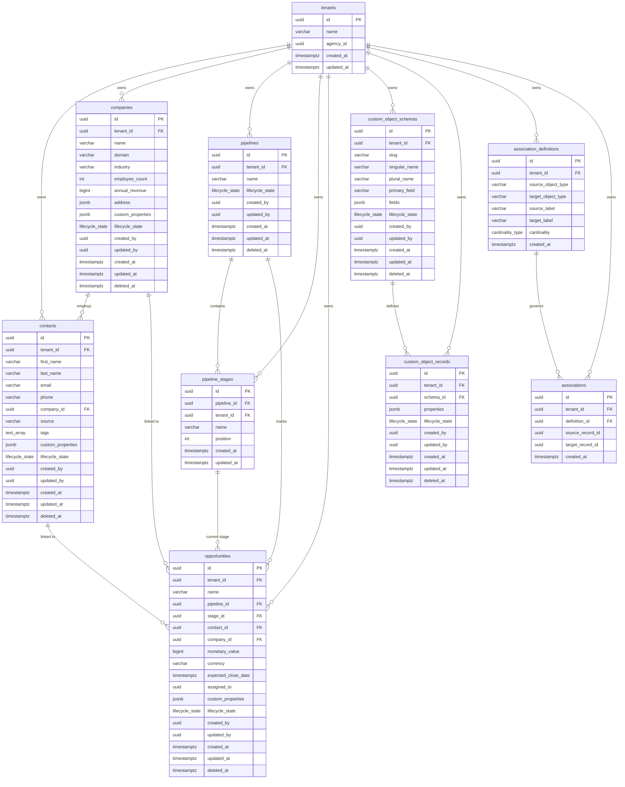

# Part 1 -- Canonical CRM Data Model & Multi-Tenant Schema

## Overview

This document describes the canonical data model for the CRM data platform. The system is built on PostgreSQL with a shared-schema multi-tenancy strategy enforced by Row Level Security (RLS). It supports core CRM entities (contacts, companies, pipelines, opportunities), tenant-defined custom objects, and a polymorphic association framework that allows typed relationships between any combination of built-in and custom object types.

All tenant-scoped tables share a common structure: a UUID primary key, a `tenant_id` foreign key for tenant ownership, a `lifecycle_state` enum for soft-delete semantics, audit timestamps, and actor tracking fields.

---

## 1. Entity Relationship Diagram



### Table Summary

| Table | Purpose | Tenant-Scoped |
|---|---|---|
| `tenants` | Tenant registry. Each tenant represents one isolated tenant. | No (root table) |
| `contacts` | People in the CRM. Linked optionally to a company. | Yes |
| `companies` | Organizations. Hold structured address and custom properties. | Yes |
| `pipelines` | Sales pipelines containing ordered stages. | Yes |
| `pipeline_stages` | Ordered positions within a pipeline. | Yes |
| `opportunities` | Deals tracked through pipeline stages. | Yes |
| `custom_object_schemas` | Metadata definitions for tenant-created object types. | Yes |
| `custom_object_records` | Instances of custom objects, storing data in JSONB. | Yes |
| `association_definitions` | Typed relationship templates between any two object types. | Yes |
| `associations` | Concrete links between two records, governed by a definition. | Yes |

---

## 2. Multi-Tenant Strategy

### 2.1 Why Shared Schema + RLS

The system uses a single PostgreSQL schema with Row Level Security (RLS) rather than schema-per-tenant or database-per-tenant. This choice is driven by three factors:

**Operational simplicity.** A single schema means one set of migration files applied once. There is no need to iterate across tenant schemas or coordinate distributed DDL changes. The migration set in this project (`000001` through `000007`) runs against a single `public` schema and covers all tenants.

**Shared connection pool.** All tenants share the same `sql.DB` connection pool, configured in `postgres.go` with `MaxIdleConns`, `MaxOpenConns`, and connection lifetime limits. Schema-per-tenant would require either one pool per tenant (exhausting file descriptors) or dynamic `SET search_path` on each request (error-prone and incompatible with prepared statements). Shared schema avoids both problems.

**Single migration set.** Adding a column, creating an index, or modifying a constraint is a single `ALTER TABLE` statement that takes effect for every tenant simultaneously. There is no fan-out, no partial failure, and no drift between tenant schemas.

### 2.2 How RLS Works

RLS is enabled on every tenant-scoped table:

```sql
ALTER TABLE contacts ENABLE ROW LEVEL SECURITY;
ALTER TABLE companies ENABLE ROW LEVEL SECURITY;
-- ... (all 9 tenant-scoped tables)
```

Each table has a single policy with both `USING` and `WITH CHECK` clauses:

```sql
CREATE POLICY tenant_isolation_contacts ON contacts
    USING (tenant_id = current_setting('app.current_tenant_id')::uuid)
    WITH CHECK (tenant_id = current_setting('app.current_tenant_id')::uuid);
```

- **`USING`** filters rows on `SELECT`, `UPDATE`, and `DELETE`. A tenant can only read or modify rows where `tenant_id` matches the session variable.
- **`WITH CHECK`** validates rows on `INSERT` and `UPDATE`. A tenant cannot write a row with a `tenant_id` that differs from the session variable.

The session variable is set via `SET LOCAL`, which scopes it to the current transaction:

```go
tx := db.WithContext(ctx).Begin()
tx.Exec("SET LOCAL app.current_tenant_id = ?", tenantID)
```

`SET LOCAL` ensures the variable is automatically cleared when the transaction ends, preventing tenant state from leaking across requests that reuse the same pooled connection.

### 2.3 Why the `app_user` Role Is Critical

PostgreSQL superusers bypass all RLS policies. The migration creates a dedicated non-superuser role:

```sql
CREATE ROLE app_user LOGIN PASSWORD 'app_password';
GRANT USAGE ON SCHEMA public TO app_user;
GRANT SELECT, INSERT, UPDATE, DELETE ON ALL TABLES IN SCHEMA public TO app_user;
```

The application connects as `app_user`. This ensures that RLS policies are always enforced at the database level, regardless of application-layer bugs. Even if a code path fails to set the session variable, the query will fail (because `current_setting` returns an empty string that cannot cast to UUID) rather than silently return cross-tenant data.

### 2.4 Defense in Depth

Tenant isolation is enforced at four layers:

1. **HTTP middleware** (`TenantExtractor`): Extracts `X-Tenant-Id` from the request header. Returns `400 MISSING_TENANT` if absent. Injects the location ID into the Go `context.Context`.

2. **Application context**: The `tenant_id` propagates through the context to every service and repository method. No database call can be made without the context carrying the tenant identifier.

3. **Database layer** (`TenantDB.Conn` / `WithTenant`): Before any query executes, the database layer opens a transaction and calls `SET LOCAL app.current_tenant_id`. This binds the tenant to the transaction scope.

4. **PostgreSQL RLS policies**: The database itself enforces row-level filtering. Even if layers 1-3 were somehow bypassed, the RLS policy on each table acts as the final guard.

### 2.5 Index Alignment with RLS

All composite indexes begin with `tenant_id`:

```sql
CREATE INDEX idx_contacts_location_lifecycle ON contacts(tenant_id, lifecycle_state);
CREATE INDEX idx_contacts_location_email ON contacts(tenant_id, email) WHERE email IS NOT NULL;
CREATE INDEX idx_opps_location_pipeline_stage ON opportunities(tenant_id, pipeline_id, stage_id);
```

This is deliberate. The RLS `USING` clause appends `WHERE tenant_id = ...` to every query. By leading indexes with `tenant_id`, the planner can satisfy the RLS filter and the application filter in a single index scan. Without this alignment, the planner would need to perform a full index scan and then filter, negating the benefit of the index.

---

## 3. Custom Field Strategy

### 3.1 Hybrid Column + JSONB Approach

The data model uses a hybrid approach for field extensibility:

- **Dedicated columns** for well-known, frequently queried fields. For example, `contacts` has `first_name`, `last_name`, `email`, `phone`, `source`, and `tags` as first-class columns with appropriate types, constraints, and indexes.
- **`custom_properties JSONB`** column on every core entity (`contacts`, `companies`, `opportunities`) and `properties JSONB` on `custom_object_records` for tenant-defined fields that vary across tenants.

This means a contact record is a single row:

```json
{
  "id": "abc-123",
  "first_name": "Jane",
  "email": "jane@example.com",
  "custom_properties": {
    "preferred_language": "en",
    "loyalty_tier": "gold",
    "nps_score": 9
  }
}
```

### 3.2 JSONB Indexing

GIN indexes with `jsonb_path_ops` are created on every JSONB column:

```sql
CREATE INDEX idx_contacts_custom_props ON contacts USING GIN(custom_properties jsonb_path_ops);
CREATE INDEX idx_companies_custom_props ON companies USING GIN(custom_properties jsonb_path_ops);
CREATE INDEX idx_opps_custom_props ON opportunities USING GIN(custom_properties jsonb_path_ops);
CREATE INDEX idx_cor_properties ON custom_object_records USING GIN(properties jsonb_path_ops);
```

The `jsonb_path_ops` operator class is chosen over the default GIN operator class because it produces a smaller, faster index optimized for containment queries (`@>`). This supports queries such as:

```sql
SELECT * FROM contacts
WHERE custom_properties @> '{"loyalty_tier": "gold"}';
```

### 3.3 Why JSONB Over EAV

The Entity-Attribute-Value (EAV) pattern was explicitly avoided. In EAV, each custom field value is stored as a separate row in a pivot table, requiring N joins or N subqueries to reconstruct a single record. JSONB stores all custom fields inline with the record, which provides:

- **Single row per record**: No joins needed to read custom fields. A `SELECT *` returns the complete entity.
- **Simpler queries**: Filtering on a custom field is a single `@>` operator, not a correlated subquery.
- **Better write performance**: Creating or updating a record is a single `INSERT` or `UPDATE`, not a batch of per-field operations.
- **Schema flexibility**: Fields can be added or removed per-tenant without DDL changes.

### 3.4 Custom Object Schema Field Metadata

The `custom_object_schemas` table stores field definitions as a JSONB array in the `fields` column. Each element follows the `FieldDefinition` structure:

```go
type FieldDefinition struct {
    Key       string              `json:"key"`
    Label     string              `json:"label"`
    FieldType valueobject.FieldType `json:"field_type"`
    Required  bool                `json:"required"`
    Unique    bool                `json:"unique"`
    Options   []string            `json:"options,omitempty"`
}
```

Supported field types: `text`, `textarea`, `number`, `date`, `phone`, `email`, `dropdown`, `boolean`.

The `primary_field` column on `custom_object_schemas` references the `key` of one field definition, designating it as the display field for the object (analogous to how a contact's name or a company's name serves as the primary identifier).

---

## 4. Relationship Modelling

### 4.1 Polymorphic Association Framework

The system implements a two-table polymorphic association pattern:

**`association_definitions`** define the _type_ of relationship:

| Column | Purpose |
|---|---|
| `source_object_type` | The type name of the source entity (e.g., `contacts`, `companies`, or a custom object slug) |
| `target_object_type` | The type name of the target entity |
| `source_label` | Human-readable label from the source side (e.g., "works at") |
| `target_label` | Human-readable label from the target side (e.g., "employs") |
| `cardinality` | Enum: `one_to_one`, `one_to_many`, `many_to_many` |

**`associations`** store the concrete links:

| Column | Purpose |
|---|---|
| `definition_id` | FK to the governing definition |
| `source_record_id` | UUID of the source record |
| `target_record_id` | UUID of the target record |

A unique constraint on `(definition_id, source_record_id, target_record_id)` prevents duplicate links.

### 4.2 Supported Relationship Types

Because the definition uses string-based object type identifiers rather than hard-coded foreign keys, the framework supports relationships between any combination of:

- Built-in types: `contacts`, `companies`, `opportunities`, `pipelines`
- Custom object types: any slug registered in `custom_object_schemas`

Example definitions:

| Source Type | Target Type | Source Label | Target Label | Cardinality |
|---|---|---|---|---|
| `contacts` | `companies` | "works at" | "employs" | `many_to_many` |
| `contacts` | `opportunities` | "involved in" | "involves" | `many_to_many` |
| `contacts` | `tickets` (custom) | "submitted" | "submitted by" | `one_to_many` |
| `projects` (custom) | `companies` | "owned by" | "owns" | `many_to_many` |

### 4.3 Cardinality Enforcement

The `cardinality_type` enum defines three modes:

- **`one_to_one`**: A source record may link to at most one target record under this definition, and vice versa.
- **`one_to_many`**: A source record may link to many target records, but each target record may link to at most one source under this definition.
- **`many_to_many`**: No cardinality restrictions beyond the uniqueness constraint on the triple `(definition_id, source_record_id, target_record_id)`.

Cardinality enforcement beyond the unique constraint is handled at the application layer: before inserting an association, the service queries existing associations for the definition and validates that the new link does not violate the declared cardinality.

### 4.4 Indexing for Traversal

Associations are indexed for bidirectional traversal:

```sql
CREATE INDEX idx_assoc_location_source ON associations(tenant_id, source_record_id);
CREATE INDEX idx_assoc_location_target ON associations(tenant_id, target_record_id);
CREATE INDEX idx_assoc_def_location_types ON association_definitions(tenant_id, source_object_type, target_object_type);
```

This allows efficient queries in both directions: "find all companies related to contact X" and "find all contacts related to company Y". The definition-level index supports discovery queries: "what relationship types exist between contacts and companies in this location?"

---

## 5. Key Invariants

### Invariant 1: Every record belongs to exactly one location

Every tenant-scoped table has `tenant_id UUID NOT NULL REFERENCES tenants(id)`. The `NOT NULL` constraint prevents orphaned records. The RLS `WITH CHECK` clause prevents a tenant from inserting a record with a different tenant's `tenant_id`. Combined, these guarantee that every record is permanently bound to one and only one tenant.

**Enforcement**: `NOT NULL` constraint, foreign key to `tenants`, RLS `WITH CHECK` policy.

### Invariant 2: Opportunities reference pipelines and stages within the same location

An opportunity has `pipeline_id` and `stage_id` as required foreign keys. RLS ensures that the `INSERT` can only succeed if the opportunity's `tenant_id` matches the session variable. Because the referenced pipeline and stage are also governed by RLS on their respective tables, they must also belong to the same location. A cross-tenant pipeline reference would fail at the FK check (the referenced pipeline would be invisible under RLS).

**Enforcement**: Foreign keys (`pipeline_id REFERENCES pipelines(id)`, `stage_id REFERENCES pipeline_stages(id)`), RLS policies on all three tables.

### Invariant 3: Soft-deleted records are excluded from normal queries but retained for reporting

The `lifecycle_state` enum (`active`, `archived`, `deleted`) combined with the `deleted_at` timestamp enables soft deletion. GORM scopes in the application layer filter deleted records:

```go
func ActiveOnly(db *gorm.DB) *gorm.DB {
    return db.Where("lifecycle_state = ?", valueobject.LifecycleActive)
}

func NotDeleted(db *gorm.DB) *gorm.DB {
    return db.Where("lifecycle_state != ?", valueobject.LifecycleDeleted)
}
```

Normal API queries apply `ActiveOnly` or `NotDeleted` scopes. Reporting or audit queries can bypass these scopes to access the full history. No physical deletion occurs.

**Enforcement**: Application-layer GORM scopes, `lifecycle_state` enum type (restricts values to the three valid states).

### Invariant 4: Custom object schema slugs are unique per location

The `custom_object_schemas` table has a composite unique constraint:

```sql
UNIQUE(tenant_id, slug)
```

This guarantees that within a single tenant, no two custom object schemas can share the same slug. Different tenants may independently create schemas with the same slug, maintaining tenant isolation while preventing naming collisions within a tenant.

**Enforcement**: `UNIQUE(tenant_id, slug)` database constraint.

### Invariant 5: Associations maintain referential integrity through their definition

Every row in `associations` has `definition_id UUID NOT NULL REFERENCES association_definitions(id) ON DELETE CASCADE`. This guarantees that:

- An association cannot exist without a valid definition.
- If a definition is deleted, all its associations are cascade-deleted, preventing orphan links.
- The unique constraint `UNIQUE(definition_id, source_record_id, target_record_id)` prevents duplicate associations under the same definition.

**Enforcement**: Foreign key with `ON DELETE CASCADE`, unique constraint on the triple.

### Invariant 6: Pipeline stages maintain unique positions within a pipeline

Pipeline stages are ordered by the `position` integer column, indexed together with `pipeline_id`:

```sql
CREATE INDEX idx_pipeline_stages_pipeline_pos ON pipeline_stages(pipeline_id, position);
```

The application layer is responsible for assigning and reordering positions. The cascade delete (`pipeline_id REFERENCES pipelines(id) ON DELETE CASCADE`) ensures that deleting a pipeline removes all its stages, preventing orphaned stages.

**Enforcement**: `ON DELETE CASCADE` foreign key, composite index on `(pipeline_id, position)`, application-layer position management.

### Invariant 7: Tenant context is always set before any query executes

The `TenantExtractor` middleware rejects requests without `X-Tenant-Id` before they reach any handler. The `TenantDB.Conn` method opens a transaction and sets `SET LOCAL app.current_tenant_id` before returning the GORM handle. If the location ID is missing from the context, the RLS policy will cause queries to fail (the `current_setting` call returns an empty string that cannot be cast to UUID), rather than returning unfiltered data.

**Enforcement**: HTTP middleware (`400 MISSING_TENANT`), `TenantDB.Conn` transaction initialization, PostgreSQL `current_setting` cast failure.

---

## Summary of Enforcement Mechanisms

| Mechanism | Where | Purpose |
|---|---|---|
| `NOT NULL` constraints | Database | Prevent missing required fields |
| Foreign key constraints | Database | Enforce referential integrity between tables |
| `UNIQUE` constraints | Database | Prevent duplicate slugs, duplicate associations |
| `CHECK` constraints (enum types) | Database | Restrict `lifecycle_state` and `cardinality` to valid values |
| RLS `USING` / `WITH CHECK` policies | Database | Tenant isolation on reads and writes |
| `app_user` role (non-superuser) | Database | Ensure RLS policies are not bypassed |
| `SET LOCAL` session variable | Database | Scope tenant context to transaction lifetime |
| `ON DELETE CASCADE` | Database | Prevent orphaned stages and associations |
| GIN indexes with `jsonb_path_ops` | Database | Efficient JSONB containment queries |
| Composite indexes leading with `tenant_id` | Database | Align index access paths with RLS filter |
| `TenantExtractor` middleware | Application | Reject requests without tenant header |
| GORM scopes (`ActiveOnly`, `NotDeleted`) | Application | Filter soft-deleted records from normal queries |
| `TenantDB.Conn` / `WithTenant` | Application | Bind tenant to database transaction |
| `FieldType.IsValid()` / `LifecycleState.IsValid()` | Application | Validate enum values before persistence |
